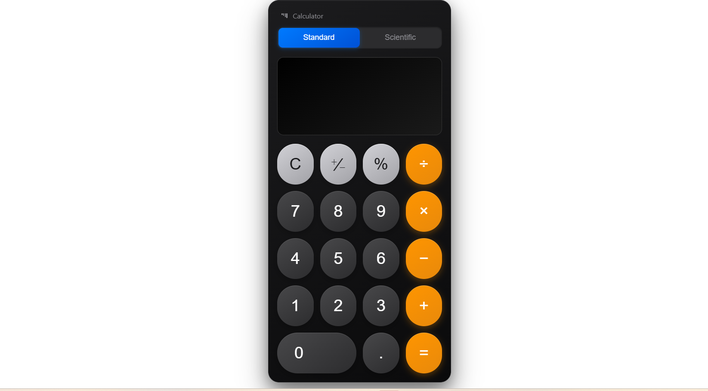
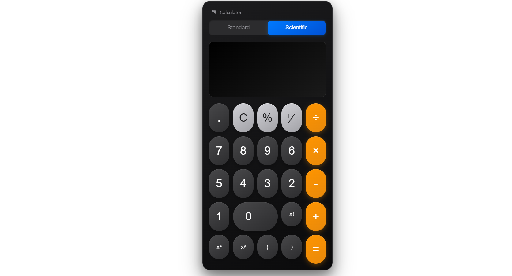

# 🎛️ My Calculator Project

A **fully functional calculator** built with **HTML, CSS, and JavaScript**, supporting both **basic and scientific operations**.

---

## Features

### Basic Calculator
- Addition, Subtraction, Multiplication, Division
- Clear and Equals buttons
- Real-time input display

### Scientific Calculator
- Trigonometric functions: `sin`, `cos`, `tan` (angles in degrees)
- Logarithmic functions: `log`, `ln`
- Square (`x²`), Power (`xʸ`), Factorial (`n!`), Square Root (`√x`)
- Constants: `π` and `e`

### Additional Features
- Mode switching between **Basic** and **Scientific** with smooth transitions
- Responsive design for desktop and mobile
- Auto-closes parentheses for calculations
- Rounds results to 6 decimal places for clarity

---

## Screenshots

**Basic Calculator Mode:**  


**Scientific Calculator Mode:**  


---

## Usage

1. Clone the repository:

```bash
git clone https://github.com/yourusername/calculator-project.git
